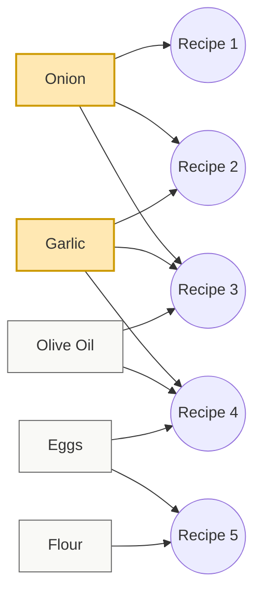

I used to run into a problem quite frequently where I would realize that my pantry didn't have the ingredients I needed at the moment for a recipe I was hoping to craft. *Whoosh*, the wind would be taken right out of my sails. There went my dinner plans, my joyful mindset, and (in a small but meaningful way) my desire to cook the recipe at all. After all, if it was going to be this much of a hassle and I had to make a separate trip to the store just to cook a meal, why bother?

With our newest update to CookCLI, I now have a tool to fix this conundrum. Gone are the headaches about whether I might have what I need for the recipe I've been dreaming of making all week. Instead, I get a clear picture: driven by a combination of math and computer science.

CookCLI can now analyze your entire recipe collection and generate an **optimal pantry plan**: a list of ingredients, ranked by how many recipes they unlock. This may seem like magic, but it's not. It's all powered under the hood by a classic computer science technique — the **greedy coverage algorithm** — adapted to real-world cooking.

Let’s walk through what it does and why it matters.


## Why Build an “Optimal Pantry”?

Cooklang already does a good job helping you track quantities, expiry dates, and what’s currently on hand, but that only helps once you’ve already made the harder decision: what belongs there in the first place. That decision is where things usually fall apart, especially after a move, a long trip, or a stretch where cooking habits change.

What I really wanted was a way to stop guessing. Instead of slowly accumulating ingredients and hoping they’d eventually form a coherent whole, I wanted to prioritize deliberately. If I were rebuilding my pantry from scratch, or even just tightening it up, which ingredients would give me the most flexibility right now? Which ones would actually unlock meals instead of sitting unused on a shelf? That’s the gap the idea of an “optimal pantry” is meant to fill.

The `cook pantry plan` command is built around that exact question. It looks at your recipe collection and works backward, identifying the smallest set of ingredients that enables you to cook the largest number of recipes. Not in theory, not based on averages or assumptions, but based on the recipes you’ve chosen to keep. The result isn’t a shopping list for an imaginary kitchen, it’s a ranked plan for yours.


## How the Greedy Coverage Algorithm Works

Like most things in my life, I tend to take the analytical approach. How might some cold, hard science address this issue? How could my coding skills get put to use in a way that would better enable my cooking abilities also? How might I turn this into something that I can share with others, to benefit their lives and their cooking hobby? So, just like with the origin of Cooklang, down the rabbit hole I went. That's where I arrived at the `greedy coverage algorithm`, the perfect tool with which to build my answer to the pantry problem.

The idea behind the algorithm is simple and practical. It will:

1. Look at every recipe in your collection.  
2. Identify all ingredients used across all recipes.  
3. Find the ingredient that appears in the most recipes.  
4. Add it to your “optimal pantry.”  
5. Mark all recipes that now become cookable.  
6. Repeat with the remaining recipes.

This process continues until:

- all recipes are cookable, or  
- you reach a limit you set with `--max-ingredients`

In computer science terms, this is a well-known approximation to the **Set Cover** problem. Finding the absolute smallest possible set of ingredients that covers every recipe would be expensive and slow, especially as collections grow. The greedy approach trades theoretical perfection for speed and clarity, which turns out to be exactly the right compromise for a kitchen tool. It produces results quickly, the logic is easy to follow, and the output aligns closely with how people naturally think about cooking.

What I like about this approach is that it mirrors real decision-making. When you’re standing in a grocery store, you’re not trying to solve an optimal proof. You’re asking yourself which item will give you the most flexibility over the next week. The algorithm formalizes that intuition. It doesn’t pretend to know the future, it just makes the best choice available at each step and moves on.


## Example: Watching Your Pantry Unlock Recipes

The easiest way to understand what this does is to see it in action.

Imagine you have a small collection of recipes. Nothing extreme, maybe twenty dishes you rotate through regularly. You run the planner like this:

`cook pantry plan`

Instead of dumping a generic shopping list, CookCLI gives you a ranked sequence of ingredients. Each one is chosen because it unlocks the largest number of recipes that were previously unavailable.

You might see something like this:

```bash
1. onion (+8 recipes, 8 total)
2. garlic (+5 recipes, 13 total)
3. olive oil (+3 recipes, 16 total)
4. eggs (+2 recipes, 18 total)
5. flour (+2 recipes, 20 total)
```

What’s happening here is incremental. Adding onions suddenly makes eight recipes possible. Garlic adds five more. Olive oil pushes the number even higher. By the time you get through five ingredients, every recipe in the collection is now cookable.

What’s important is why these ingredients appear. They’re not being suggested because they’re universally essential or because every kitchen is supposed to have them. They rise to the top because your recipes depend on them more than anything else. The plan reflects your habits, not someone else’s idea of a perfect pantry. That’s also why the order matters. The first ingredient isn’t just “important,” it’s disproportionately important. It unlocks more meals than anything else you could buy. Each step after that fills in the remaining gaps until the collection becomes complete.

At that point, pantry planning stops feeling abstract. You’re no longer wondering what might be useful someday. You can see, concretely, how each ingredient expands what you’re able to cook right now. The output isn’t just a list, it’s a narrative of how your pantry becomes more capable with each addition.


## How The Plan Model Fits Into The World

One thing I didn’t want this feature to do was assume that everyone starts from zero or cooks under perfect conditions. Most people already have a few staples at home, and most people are also willing to improvise when a recipe is almost, but not quite, doable.

That’s why the `plan` command lets us bend the rules a little.

If you already have some basics covered, you can tell CookCLI to treat the first few ingredients in the plan as already handled and focus only on what to add next. Using the `--skip` option, you can effectively say, “Assume I already have these, what’s the next best move?” Instead of being overwhelmed by a long list, you get a short, focused set of ingredients that actually expands your options right now. It’s especially useful when restocking gradually or trying to be intentional about what you buy next rather than filling your pantry all at once.

Cooking (unlike computers) isn’t binary. In practice, being short one ingredient doesn’t always stop you from cooking a dish. Sometimes it’s optional, sometimes it’s easy to substitute, and sometimes you just plan to shop again soon. The `--allow-missing` option reflects that reality by letting recipes count as cookable even if they’re missing a small number of items. This softens the definition of “cookable” just enough to match how people actually behave in the kitchen, without turning the plan into guesswork.

Finally, for people who want to go further, the planner supports structured output in JSON and YAML. That makes it easy to integrate with other tools, whether that’s building dashboards, generating shopping lists automatically, feeding data into meal planners, or experimenting with more advanced automation. The same plan that’s readable in a terminal can also become part of an application or database if you want it to.

Together, these options keep the system grounded in reality. It stays opinionated enough to be useful, but flexible enough to fit into real kitchens and real workflows instead of forcing everything into a rigid model. It doesn't demand that you and I be anything more than human beings, or that our pantries be anything other than the beautiful, imperfect messes that they so often are.


## A Diagram

Below is a Mermaid diagram illustrating how the greedy coverage algorithm works across recipes and ingredients. It shows ingredients (squares) connected to recipes (circles) based on usage. The algorithm then selects the most connected ingredient first, removes covered recipes, and continues with the next best choice.



How to read this diagram:

- Squares represent ingredients.
- Circles represent recipes.
- A line means this ingredient appears in that recipe.

The greedy algorithm works as follows:

1. Onion appears in the most recipes (Recipe 1, 2, 3), so it is chosen first and highlighted.
2. Once those recipes are considered “covered,” the algorithm looks at the remaining ones.
3. Garlic is then the ingredient with the highest remaining coverage (Recipe 3 and 4), so it is chosen next.
4. The process continues until you reach full coverage or hit a user-defined limit.
5. This makes it visually clear how each ingredient expands the set of recipes you can cook, and why the greedy algorithm tends to choose ingredients with many connections early on.

## The Big Picture: A Smarter, Smaller, More Efficient Pantry

The more I worked on this, the more it became clear that the goal was never to build a bigger pantry. One lesson I've picked up over the years is that quality is usually superior to quantity. Sure, if you have the resources to do nothing but obsess over expiration dates and cooking plans, maybe you want the biggest collection of ingredients that money can buy. But if you're like most of us and have a full-time job, obligations, and family or friends to spend time with, then you simply don't have that kind of headspace.

Bigger pantries are easy (and too often wasteful). You can always buy more ingredients. What’s harder, more efficient, and far more useful, is building a pantry that actually supports the way you cook. One that gives you flexibility instead of friction, and options instead of guesswork. Besides, your wallet will definitely thank you!

By ranking ingredients based on how much real cooking value they provide, the `plan` command helps shift pantry planning away from accumulation and toward intention. Instead of asking what you might need someday, you can focus on what actually unlocks meals for you right now. That naturally leads to less waste, fewer unnecessary purchases, and a clearer sense of which ingredients genuinely matter in your kitchen.

What I like about this approach is that it doesn’t feel abstract once you use it. There’s nothing theoretical or overly complex about watching a short list of ingredients steadily unlock more and more recipes. It’s a very basic kind of logic, grounded in how people cook day to day, expressed through a simple command that stays out of the way. And this is only the starting point. I have plenty of room to grow this idea further, whether that’s accounting for substitutions, planning across multiple weeks, or adapting recommendations as cooking habits change over time. The core idea stays the same: use the data you already have to make better, calmer decisions.

For now, the greedy coverage algorithm offers something quietly powerful. It gives home cooks a concrete, data-driven way to build a pantry that fits their life, reduces friction, and makes it easier to cook the meals they actually want to cook. And here is the simple reminder of why all those years of study really mattered: when the concepts I gleaned can be put to use for benefit in my life and the lives of others. That's where the rubber truly meets the road, after all.
