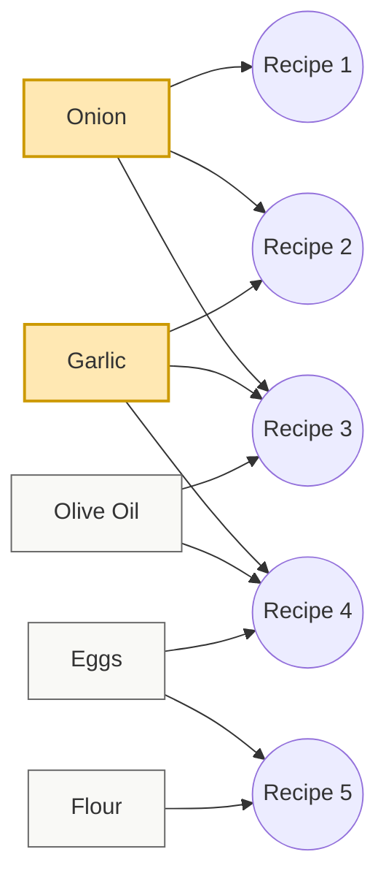

Most home cooks don’t struggle because they lack skill — they struggle because they lack the *right* ingredients at the *right* time.

Maybe you’ve experienced this. One day you're looking through a few recipes and realize each one needs a different missing ingredient. You had bought a bunch of stuff, but half of it sits unused. Cooking becomes guesswork instead of something simple and joyful.

With the newest update to CookCLI, we now have a tool to fix this.

CookCLI can analyze your entire recipe collection and generate an **optimal pantry plan**: a list of ingredients, ranked by how many recipes they unlock. And under the hood, it’s powered by a classic computer science technique — the **greedy coverage algorithm** — adapted to real-world cooking.

Let’s walk through what it does and why it matters.


## Why Build an “Optimal Pantry”?

Cooklang already supports tracking pantry quantities, expiry dates, and what you currently have on hand. But what about people who are restocking their pantries after a move or a vacation, want to cook more efficiently, want a more streamlined pantry, want to know what core ingredients to prioritize, or want to maximize what they can cook at any given moment?

The new `cook pantry plan` command solves this by answering one question:

**“What is the smallest set of ingredients that unlocks the largest number of my recipes?”**

This transforms your pantry from a random collection of groceries into a strategic toolkit.


## How the Greedy Coverage Algorithm Works

The idea behind the algorithm is simple and practical:

1. Look at every recipe in your collection.  
2. Identify all ingredients used across all recipes.  
3. Find the ingredient that appears in the most recipes.  
4. Add it to your “optimal pantry.”  
5. Mark all recipes that now become cookable.  
6. Repeat with the remaining recipes.

This process continues until:

- all recipes are cookable, or  
- you reach a limit you set with `--max-ingredients`

In computer science terms, this is a variation of the **Set Cover** problem, which asks, “Given a bunch of groups, what is the smallest number of items I can pick so that every group contains at least one of the items I picked?”. In kitchen terms, it’s a way to figure out the highest-potential ingredients, the easiest ways to expand your cooking options, and the order of importance for restocking or enhancing your pantry.

It’s efficient, intuitive, and ideal for real kitchen workflows.


## Example: Watching Your Pantry Unlock Recipes

Let’s say you have twenty recipes. After running the plan:

`cook pantry plan`

You might see output like:

```bash
1. onion (+8 recipes, 8 total)
2. garlic (+5 recipes, 13 total)
3. olive oil (+3 recipes, 16 total)
4. eggs (+2 recipes, 18 total)
5. flour (+2 recipes, 20 total)
```

With just **five ingredients**, you can now cook **all twenty recipes**.

Not because these are universal kitchen staples — but because your own recipes use them frequently.

This is personalized cooking intelligence.


## Skipping Ingredients You Already Have

Most cooks already have a few basics. The `--skip` flag lets you say, “Pretend I already have the first N ingredients.”.

Example:

`cook pantry plan --skip 3`


This hides the first three recommendations and shows what to buy next. This is perfect for assistance restocking intelligently, prioritizing what your pantry needs most right now, and minimizing the laborious use of long shopping lists.


## Allowing Recipes with Missing Ingredients

Cooking is flexible. You can choose to treat recipes as “cookable” even if they’re missing a small number of items.

For that, use `--allow-missing`:

`cook pantry plan --allow-missing 1`

This is useful when you can leave out or replace a missing item, you are just improvising something new, or you are planning to go to the store again soon.

It softens the definition of “cookable” to match real life.


## JSON and YAML Outputs for Automation

As with other CookCLI commands, the planner supports structured formats (JSON or YAML).

These outputs can be used for automation, dashboards, meal planners, shopping or recipe apps, and even AI integration.

Anywhere data can flow, CookCLI can integrate.


## A Diagram

Below is a Mermaid diagram illustrating how the greedy coverage algorithm works across recipes and ingredients. It shows ingredients (squares) connected to recipes (circles) based on usage. The algorithm then selects the most connected ingredient first, removes covered recipes, and continues with the next best choice.



How to read this diagram:

- Squares represent ingredients.
- Circles represent recipes.
- A line means this ingredient appears in that recipe.

The greedy algorithm works as follows:

1. Onion appears in the most recipes (Recipe 1, 2, 3), so it is chosen first and highlighted.
2. Once those recipes are considered “covered,” the algorithm looks at the remaining ones.
3. Garlic is then the ingredient with the highest remaining coverage (Recipe 3 and 4), so it is chosen next.
4. The process continues until you reach full coverage or hit a user-defined limit.
5. This makes it visually clear how each ingredient expands the set of recipes you can cook, and why the greedy algorithm tends to choose ingredients with many connections early on.

## The Big Picture: A Smarter, Smaller, More Efficient Pantry

Your pantry doesn’t need to be massive — it needs to be **optimized**.

By ranking ingredients based on how much cooking value they provide, CookCLI helps you unlock the most recipes with the fewest ingredients, reduce food waste, shop intentionally, and understand where your ingredients matter the most. This command will absolutely help you build the pantry that is well suited to you, personally, and saves you time, effort, and money.

This is not just theoretical computer science being put into use.  
It’s practical, efficient, everyday kitchen logic in a clean and accessible command.

And it’s just the beginning.

Future improvements may include substitution awareness, multi-week meal coverage, or adaptive pantry planning based on cooking history.

For now, the greedy coverage algorithm gives home cooks something incredibly powerful:

**A scientific way to stock the pantry that fits their life — and unlocks the meals they actually want to cook.**
